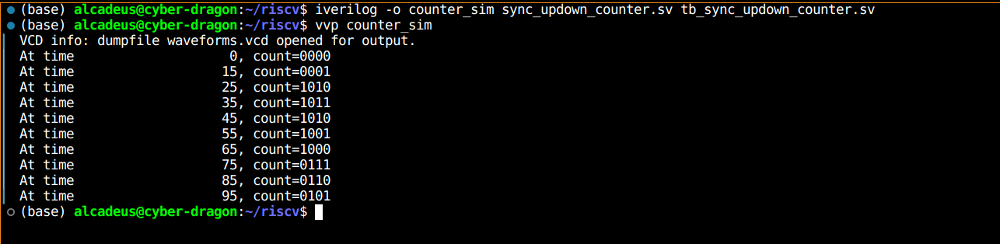
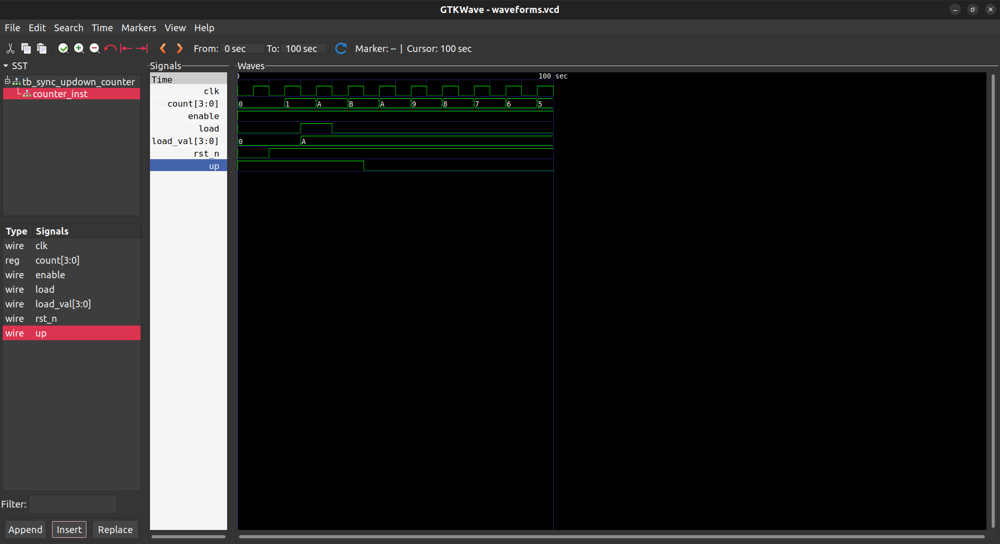

# SystemVerilog Counter Module and Testbench

This repository contains a SystemVerilog module for a 4-bit synchronous up/down counter with enable, asynchronous reset, and synchronous load, as well as a testbench for simulating and verifying the counter's functionality.

## Files Included

- `sync_updown_counter.sv`: The SystemVerilog module for the 4-bit synchronous up/down counter.
- `tb_sync_updown_counter.sv`: The testbench for the synchronous up/down counter.

## Prerequisites

- Icarus Verilog: A compiler for Verilog and SystemVerilog code.
- GTKWave: A waveform viewer for analyzing the simulation results.

## Usage Instructions

1. Open a terminal and navigate to the directory containing the `sync_updown_counter.sv` and `tb_sync_updown_counter.sv` files.
2. Compile the SystemVerilog files using the `iverilog` command:

   ```bash
   iverilog -o counter_sim sync_updown_counter.sv tb_sync_updown_counter.sv
   ```

3. Run the simulation using the `vvp` command:

   ```bash
   vvp counter_sim
   ```

4. (Optional) To view the waveforms, generate a VCD file during simulation by running the simulation as shown above. Then, open the `waveforms.vcd` file with GTKWave:

   ```bash
   gtkwave waveforms.vcd
   ```

## Running Tests

After compiling and running the simulation, the testbench will apply a reset, load an initial value, toggle the up/down direction, and run for a while. The monitor will show the count value, and GTKWave can be used to view the waveforms for a graphical analysis.




Simulator Output on GTKWaveforms 



## License

This project is licensed under the MIT License. See the `LICENSE` file for details.